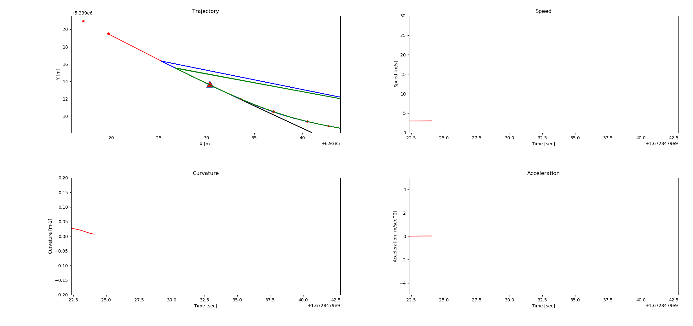
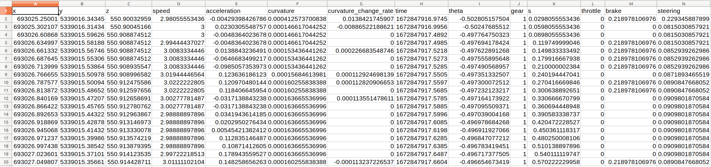

# Apollo Tools

## Prerequisites
Use Apollo Tools in docker container.
(`bash docker/scripts/dev_start.sh`
`bash docker/scripts/dev_into.sh`)

## Highlight Tools
Reference: https://github.com/fortiss/apollo/blob/dev_fortiss/modules/tools/README.md

1. Use Realtime_plot to plot real-time trajectory, curvature, speed, acceleration for .record files --> For data analysis

    ```
    bash scripts/realtime_plot.sh
    ```

Then replay a .record file in Dreamviewer:

`bash scripts/bootstrap.sh`, then `cyber_recorder play -f path_of_your_record_file` or `cyber_recorder play -f path_of_your_record_file --loop` (for cycle replay)

Optional: save the plot in your prefer direction.


2. Use Rtk_recorder to record status information from a .record file:

* Rtk_recorder

    ```
    bash scripts/rtk_recorder.sh
    ```
    
Then replay a .record file in Dreamviewer and the status information will be saved in a .csv file under direction `apollo/data/log` automatically:



* Rtk_player

Use SimCtrl in Dreamview to simulate letting the ego car drive by following the trajectory based on the data in above .csv file:

    ```
    bash scripts/rtk_player.sh
    ```

