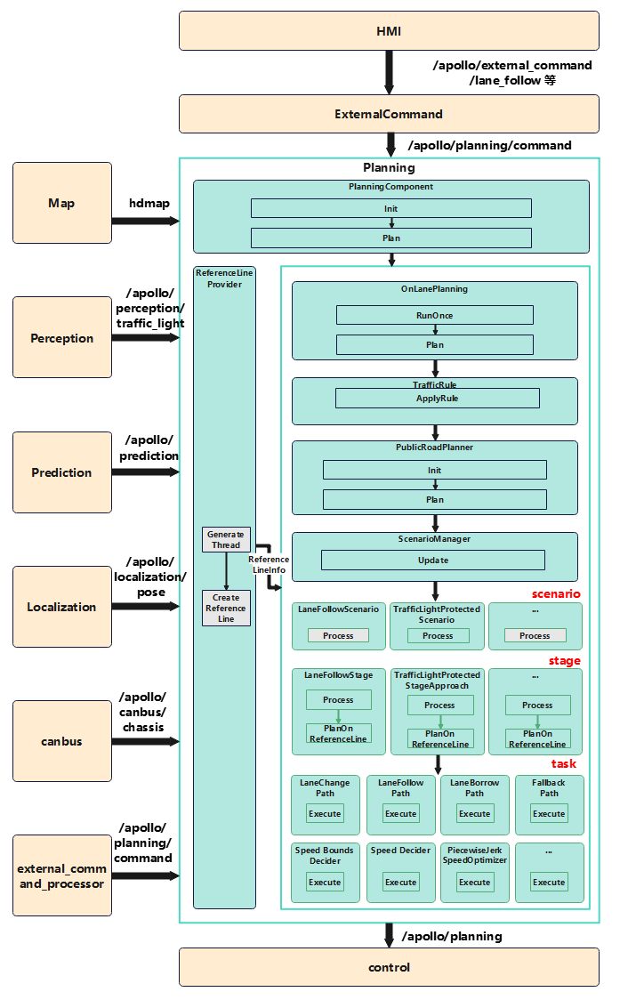

# planning

## 简介
`planning base`是planning模块的主要流程和入口package，包含planning模块的整体架构和流程。
planning模块根据上游模块输入的感知周围环境信息，地图定位导航信息，以及全局路径信息，为自动驾驶车辆规划出一条运动轨迹（包含坐标，速度，加速度，jerk加加速度，时间等信息），然后将这些信息传递给控制模块。


`planning-base` 是planning模块的基础数据结构和算法库，它包含了模块运行流程中公共的数据结构类，以及底层算法函数。

## 目录结构

```shell

modules/planning/planning_base
├── planning_base
    ├── common                  // 公共算法库
    ├── gflags                  // gflag参数配置
    ├── learning_based          // 基于学习算法相关库
    ├── math                    // 基础数学库
    ├── open_space              // open_space相关算法库
    ├── proto                   // 公共（全局）参数配置结构定义
    ├── reference_line          // 参考线以及参考线处理类
    ├── testdata                // 单元测试数据
    ├── tools                   // 工具类
    ├── BUILD                   // 构建规则文件
    ├── cyberfile.xml           // 包管理配置文件
    └── README_cn.md            // 说明文档
```

